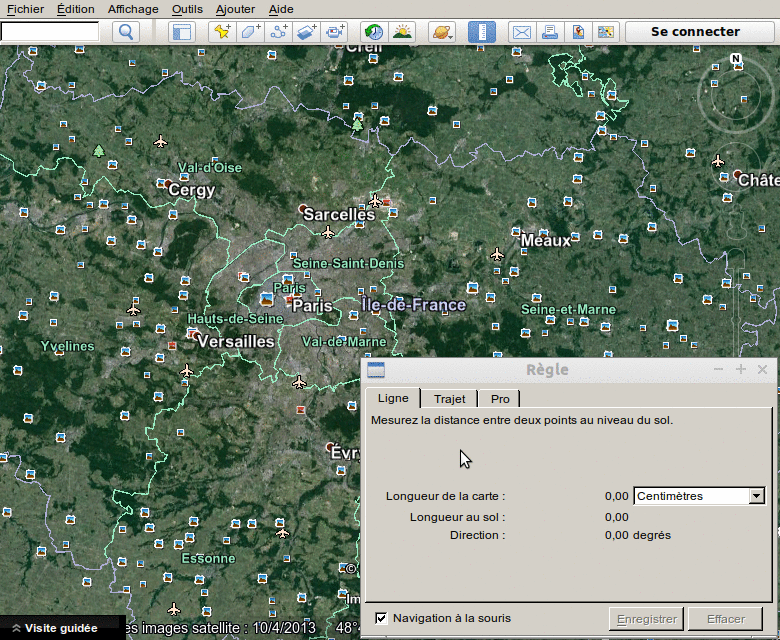
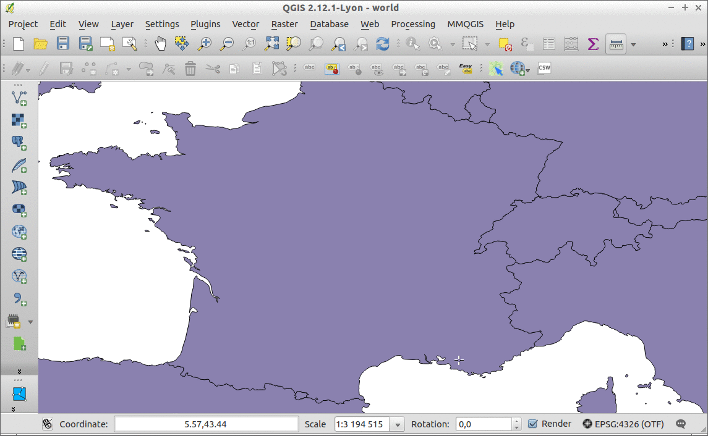

.. AzimuthMeasurement documentation master file, created by
   sphinx-quickstart on Sun Feb 12 17:11:03 2012.
   You can adapt this file completely to your liking, but it should at least
   contain the root `toctree` directive.

QGIS Azimuth Measurement documentation
======================================

.. toctree::
   :maxdepth: 2

Purpose
-------

This plugin was created to mimic the behaviour from :boltitalic:`Google Earth©` as illustrated below.
We only choose to display information in a widget instead of a dialog.

You just want to draw a temporary start point, draw a end point and then display the resulting distance and azimuth.
At the moment, we don't give the option to save the line drawing.

Installation
------------

You just need to install it through the menu `Plugins` > `Manage and Install Plugins...` and choose `Azimuth Measurement`.

.. warning:: You need to tick `Show also Experimental plugins` in `Settings` lateral tab or you will not see the plugin.

Usage
-----

You just have to follow below demontration to understand how to use the plugin.

Credits
-------

The logo copyright is from the icon created by Denis Moskowitz from the Noun Project under `Licence CC BY 3.0 US <http://creativecommons.org/licenses/by/3.0/us/>`_.

For the azimuth calculation, we choose to reuse `pygc <https://github.com/axiom-data-science/pygc>`_, a MIT licensed Python azimuth calculation library (so we can sublicence it in the GPL plugin code). We removed the dependency to `Numpy` Python package from it.

Alternatives
------------

Depending of your requirements, you may prefer using other plugins, more complex and for other use cases:

- `Azimuth and Distance Plugin <http://planet.qgis.org/plugins/qgsAzimuth/>`_
- `Azimuth and Distance Calculator <http://planet.qgis.org/plugins/AzimuthDistanceCalculator/>`_ 

Contact us
----------

You can open an issue on `the repository <https://github.com/webgeodatavore/azimuth_measurement/issues>`_ or drop us an email at contact(at)webgeodatavore.com

We also do QGIS support for users and Python development in France. You can see more at `our official website <http://webgeodatavore.com/en/>`_.

Indices and tables
==================

* :ref:`genindex`
* :ref:`modindex`
* :ref:`search`

